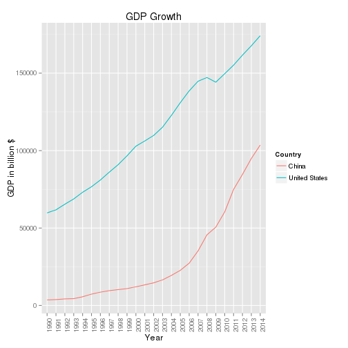

Developing Data Products - Project
========================================================
author: Seegler 
date: Sun Jul 26 23:47:56 2015
transition : rotate


About the Project
========================================================

This presentation is being created as part of the peer assessment for the coursera developing data products class. 

As part of this project,
- GDP Explorer, a Shiny application, has been developed and hosted at ShinyApps[link]. 
- Source code of the application is available at GitHub[link]

GDP Explorer - Application
========================================================
GDP Explorer application helps user to explore the GDP of countries and compare their GDP growth from year 1960 to 2014. User can choose or adjust following interactive fields:

- Select the range of years to explore. Range is available between 1960 to 2014
- Select one or more countries to explore from a list of available countries


GDP Explorer - Data
========================================================
GDP data used in this project is downloaded from [World Bank API server](http://api.worldbank.org/v2/en/indicator/ny.gdp.mktp.cd?downloadformat=csv). Downloaded data has been uploaded under this project's GitHub repo[Link]()

Variables in this GDP data set:

```r
names(data)
```

```
 [1] "Country Name"   "Country Code"   "Indicator Name" "Indicator Code"
 [5] "1960"           "1961"           "1962"           "1963"          
 [9] "1964"           "1965"           "1966"           "1967"          
[13] "1968"           "1969"           "1970"           "1971"          
[17] "1972"           "1973"           "1974"           "1975"          
[21] "1976"           "1977"           "1978"           "1979"          
[25] "1980"           "1981"           "1982"           "1983"          
[29] "1984"           "1985"           "1986"           "1987"          
[33] "1988"           "1989"           "1990"           "1991"          
[37] "1992"           "1993"           "1994"           "1995"          
[41] "1996"           "1997"           "1998"           "1999"          
[45] "2000"           "2001"           "2002"           "2003"          
[49] "2004"           "2005"           "2006"           "2007"          
[53] "2008"           "2009"           "2010"           "2011"          
[57] "2012"           "2013"           "2014"           ""              
```

GDP Explorer - Sample Plot
========================================================
GDP Explorer presents the GDP growth in line plots for the selected countries and range of years. For example, GDP for United States and China from 1990 and 2014 would be shown as follows

 
